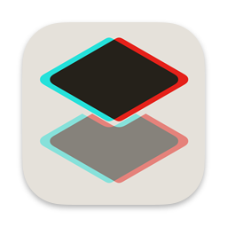

# SpatialThumbnail

_A free and open source macOS app to capture spatial screenshots from spatial videos._

By [Anthony Maës](https://www.linkedin.com/in/portemantho/) ([Acute Immersive](https://acuteimmersive.com/)), with a file borrowed from the [Writing spatial photos sample](https://developer.apple.com/documentation/imageio/writing-spatial-photos) by Apple. 

SpatialThumbnail is a macOS app that reads MV-HEVC Spatial Videos and takes screenshots at the current frame, saving it separately as left eye and right eye (JPEG) and as stereoscopic spatial image (HEIC).

## Features
* **Only local MV-HEVC video files are supported.** Other formats will not display correctly without code modifications.
* Load a video from the local file system only.
* Press the Screenshot button to generate the spatial screenshot.
* Optionally crop the screenshot to the desired dimensions

## Requirements
* macOS 15 Sequoia or later

## Installation
- Download the latest .dmg from [releases](https://github.com/acuteimmersive/spatialthumbnail/releases)
- Open the .dmg file, drag and drop **Spatial Thumbnail.app** to the Applications folder

## Build
- Requires Xcode 16 or later
- Clone the repo
- Open SpatialThumbnail.xcodeproj in Xcode
- Update the signing settings (select the correct development team)
- Run (⌘R)

## Contributions
While this project aims to remain relatively concise and lightweight to allow for modifiability, it needs a few more basic features and better error handling. Contributions are greatly appreciated!

Desired improvements:
- UI for tweaking spatial encoding parameters (baseline, FOV, disparity)
- Dynamic loading of those parameters from video metadata
- Support for sizing down the image
- Menu and drag & drop support
